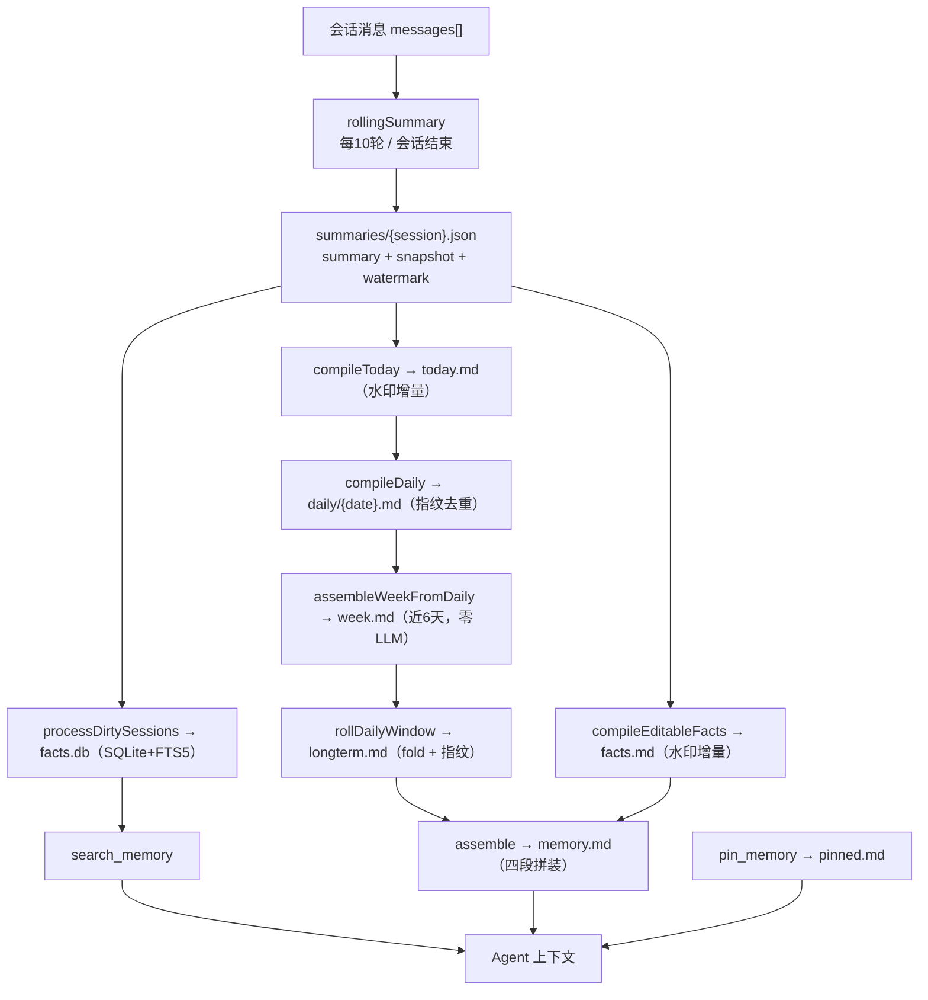

# memory-flow 架构说明

## 逻辑框架

## 六层说明

| 层 | 说明 |
|---|---|
| 原始层 | 会话完整记录，保留原始细节，不进入上下文 |
| 摘要层 | 每个会话一份滚动摘要，格式契约固定两节；写前校验，失败调用格式修复器重排 |
| 编译层 | today（当天草稿，增量）→ daily（昨日日记）→ week（近 6 天拼装）→ longterm（出窗折叠） |
| 事实层 | facts.md 常驻上下文，只保留稳定的用户画像事实 |
| 深度记忆层 | facts.db 存元事实（fact+tags+time+session），标签优先检索、FTS5 全文兜底 |
| 置顶层 | 用户显式"记住这个"，永远在上下文 |

## 关键机制

### 1. 格式契约单一来源

`src/summary/rolling-summary-format.ts` 同时提供输出格式要求（prompt 用）、结构校验器（写盘前用）、段提取器（下游 facts/timeline 用）。改名只改一处，prompt 与解析器永不失配。

### 2. 水印增量（成本控制）

`today-state.json` / `editable-facts-state.json` 记录上次已编译的摘要 `updated_at`，每次只把 delta 喂给 LLM。同一批会话不会反复触发。

### 3. 指纹去重

`compileDaily` 按事件 key 列表、`compileLongterm` 按输入内容计算 md5 指纹，未变化直接跳过，防止同一批内容反复折叠。

### 4. 脏会话追踪

`summary !== snapshot` 即 dirty；`processDirtySessions` 对 dirty 会话做快照 diff，LLM 提取新增原子事实，提交前校验 revision 未变（防竞态），处理完推进快照。

### 5. 确定性拼装与 LLM 压缩分离

`assemble()`、`assembleWeekFromDaily()` 是纯文件操作（零 LLM）；只有语义压缩（摘要、日记、折叠、事实提取）才调用 LLM。

### 6. 可读中间产物与人工编辑尊重

每层都是人类可读 Markdown；today/longterm/facts 可手改，编译以现有文件为基线。记忆可审计、可修正。

### 7. 写入边界 PII 脱敏

摘要、事实、置顶记忆落盘前统一脱敏（手机/邮箱/身份证），脱敏后再次校验格式契约。

### 8. 可注入时钟与断点续跑

`createLogicalDayClock(now?)` 让演示与测试能确定性推进逻辑日（日界线 4:00）；每日任务按步骤 checkpoint 到 `daily-state.json`，失败步骤恢复重试。

## 数据流示例（examples/conversations.json）

投喂 3 段会话（08-02/08-03/08-04）后：

1. 每会话生成滚动摘要（重要事实 + 事情经过）。
2. `compileToday` 把 08-04 的摘要增量编译进 today.md。
3. 推进逻辑日，`compileDaily` 把昨日蒸馏成 `daily/2026-08-04.md` 日记；`assembleWeekFromDaily` 拼出 week.md。
4. 再推进 6 天，`rollDailyWindow` 把 08-04 折叠进 longterm.md 并删除源文件。
5. `compileEditableFacts` 产出 facts.md；`assemble` 生成四段 memory.md。
6. `processDirtySessions` 把摘要拆成元事实入库，`search_memory` 可检索（标签优先、全文兜底）。
