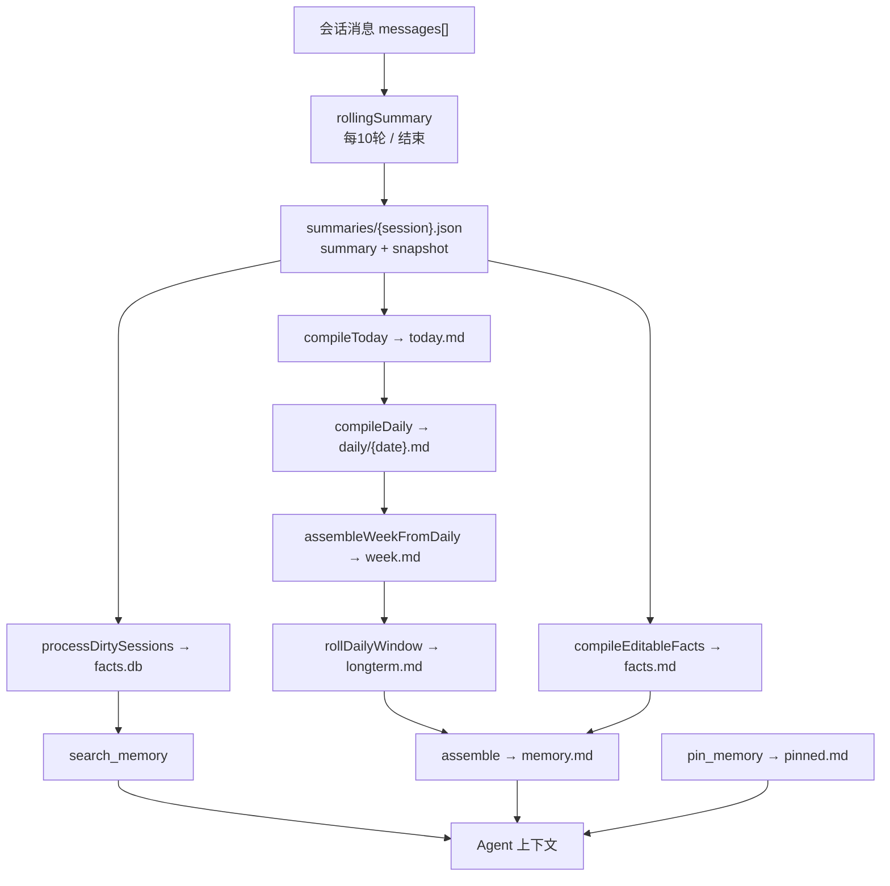

# memory-flow 设计规格

- 日期：2026-08-02
- 状态：已确认（用户审阅中）
- 项目类型：独立 TypeScript 核心库 + CLI
- 面试方向：LLM/Agent 应用工程师

## 1. 项目概述

`memory-flow` 是一个面向 LLM Agent 的**渐进式分层记忆系统**。它从开源项目
OpenHanako（HanaAgent，Apache-2.0，作者 liliMozi）的 `lib/memory/` 记忆子系统
中忠实提取，去除外围应用层（Electron/React/Server/Bridge/Plugin），保留记忆
系统的全部核心机制，形成可独立运行、可测试、可演示的个人面试项目。

核心思想一句话：**"按天滚动的记忆传送带"**——会话消息先由 LLM 压缩为每会话
滚动摘要，再逐日蒸馏为日记，日记滚出窗口后折叠进长期记忆，最终拼装成一份
常驻上下文的 `memory.md`；另有一条深度记忆支线，把摘要中的用户画像拆成带标签
的元事实存入 SQLite（FTS5），供 Agent 用 `search_memory` 工具按需检索。

## 2. 目标与成功标准

### 2.1 目标

1. 忠实还原 OpenHanako 记忆系统的逻辑框架与核心机制，可对照原项目讲解。
2. 零外围依赖，`npm install && npm run demo` 一条命令可离线跑通完整演示。
3. LLM 调用可插拔（任意 OpenAI 兼容端点），并提供确定性 FakeLLM 便于测试与演示。
4. 测试覆盖核心契约，`npm test` 与 `npm run typecheck` 全绿。
5. 交付面试讲稿，回答"为什么这样设计""如何控制成本""如何保证一致性"等高频问题。

### 2.2 成功标准

- 不依赖 OpenHanako 任何代码文件（独立实现，保留 Apache-2.0 声明与出处说明）。
- 完整演示流程：投喂多段会话 → 滚动摘要 → 跨天 → 日记/周/长期 → memory.md →
  search_memory 检索，全程可见、可读。
- 核心机制均有单测：格式契约、水印增量、指纹去重、脏会话、FTS5 中文检索、调度顺序。

## 3. 范围边界

### 3.1 完整保留（核心机制）

| 机制 | 说明 |
|---|---|
| 滚动摘要格式契约 | `### 重要事实/Key Facts` + `### 事情经过/Timeline` 两节固定结构；prompt、写前校验、提取解析共用同一份契约（单一来源） |
| 写前校验 + 格式修复 | 摘要写盘前校验结构，失败最多 1 次调用"格式修复器"重排，不新增不删除事实 |
| 水印增量编译 | today.md 与 facts.md 通过 `today-state.json` / `editable-facts-state.json` 记录水位，只把 delta 喂给 LLM |
| 指纹去重 | compileDaily 与 compileLongterm 用内容指纹（md5）跳过未变化的重叠输入，防止同一批内容反复折叠 |
| 脏会话追踪 | summary ≠ snapshot 即 dirty，deep-memory 按 diff 提取新增事实，处理完快照推进 |
| 逻辑日与时间上下文 | 按日界（默认 4:00）切分逻辑日；事实时间从摘要时间戳 + 来源时间范围规范化，跨日歧义时置 null |
| 置顶记忆双写 | `pinned.md`（人类可读）+ `pinned-memory.json`（结构化），按 mtime 解决手写冲突 |
| 每日调度与断点续跑 | 10 轮触发 / 会话结束 / 日期切换；每日任务按步骤 checkpoint，失败步骤可恢复 |
| PII 脱敏 | 摘要、事实写入边界统一脱敏 |
| 原子写 | 所有产物 tmp+rename 原子写入，防半写文件 |
| 预算控制 | 摘要预算随轮数线性缩放（40 字/轮，封顶 400 字）；推理模型预留 reasoning buffer |

### 3.2 合理简化（文档中说明理由）

| 原版机制 | 简化处理 |
|---|---|
| 频道作用域隔离 | 去掉（单 Agent 场景不需要跨频道权限） |
| 分支游标 / lineage hash | 简化为 `replaceSessionSummary()` 显式重建模式，保留数据一致性语义，砍掉 projection 复杂度 |
| 缓存快照反射 | 原版已硬停用，直接去掉 |
| 多 Agent / 花名册 / 子代理 | 去掉（属于 Agent 层，不属于记忆层） |
| 记忆健康检查 UI / 设置页 | 去掉（CLI 输出代替） |

### 3.3 明确去掉

- Electron 桌面端、React 前端、Hono Server、Bridge 适配器、插件系统、技能系统。
- 会话管理、角色卡导入导出、定时任务（非记忆职责）。
- 对 OpenHanako 内部模块（core/、shared/、hub/）的任何运行时依赖。

## 4. 架构与模块划分

```
memory-flow/
├── package.json
├── tsconfig.json
├── vitest.config.ts
├── README.md
├── LICENSE                       # Apache-2.0
├── docs/
│   ├── architecture.md           # 逻辑框架图与分层说明
│   ├── interview.md              # 面试讲稿
│   └── superpowers/specs/        # 设计规格
├── src/
│   ├── index.ts                  # 公共 API 出口
│   ├── llm/
│   │   ├── types.ts              # LLMProvider 接口与消息类型
│   │   ├── openai-compatible.ts  # OpenAI 兼容 HTTP 实现
│   │   └── fake-llm.ts           # 确定性假模型（离线演示/测试）
│   ├── summary/
│   │   ├── rolling-summary-format.ts  # 格式契约（单一来源）
│   │   ├── session-summary.ts    # SessionSummaryManager
│   │   └── prompts/
│   │       ├── rolling-summary.ts
│   │       └── fact-extraction.ts
│   ├── compile/
│   │   ├── compile.ts            # 编译管线（today/daily/week/longterm/facts/assemble）
│   │   ├── compiled-memory-state.ts   # 归一化/重置标记/产物清理
│   │   └── compiled-memory-snapshot.ts # 四段快照读写
│   ├── deep-memory/
│   │   ├── fact-store.ts         # SQLite + FTS5 事实库
│   │   ├── deep-memory.ts        # 脏会话 → 事实提取
│   │   └── memory-search.ts      # search_memory 检索逻辑
│   ├── pinned/
│   │   └── pinned-memory-store.ts
│   ├── ticker/
│   │   └── memory-ticker.ts      # 调度器
│   ├── time/
│   │   ├── logical-day.ts        # 逻辑日切分
│   │   └── time-context.ts       # 时区/事实时间规范化
│   └── util/
│       ├── safe-fs.ts            # 原子写
│       └── pii-guard.ts          # PII 脱敏（内置规则集）
├── cli/
│   └── demo.ts                   # 面试演示
├── examples/
│   └── conversations.json        # 模拟会话（中英双语，2~3 段）
└── test/
    ├── rolling-summary-format.test.ts
    ├── session-summary.test.ts
    ├── compile.test.ts
    ├── fact-store.test.ts
    ├── memory-search.test.ts
    ├── memory-ticker.test.ts
    └── e2e-demo.test.ts
```

### 4.1 模块职责与接口

**llm/types.ts**——`LLMProvider` 接口：

```ts
interface LLMProvider {
  chat(input: {
    system: string;
    user: string;
    maxTokens: number;
    temperature?: number;
  }): Promise<{ text: string }>;
}
```

所有编译/摘要/提取步骤只依赖此接口，不感知具体厂商。

**summary/session-summary.ts**——`SessionSummaryManager`：

- `rollingSummary(sessionId, messages, llm, opts)`：合并旧摘要与新消息生成新摘要（覆盖式），
  写前校验 + 格式修复 + PII 脱敏，落盘 `summaries/{sessionId}.json`。
- 记录 `{ summary, snapshot, messageCount, snapshot_at, factReplacementRequired }`。
- `getDirtySessions()` / `markProcessedIfCurrent()`：供 deep-memory 使用。
- `replaceSessionSummary(sessionId, messages, llm, opts)`：分支重建模式，强制全量重算并
  标记 `factReplacementRequired`（简化版替代原版 lineage 机制）。
- `invalidateSession(sessionId)`：删除派生状态（摘要 + 事实）。

**compile/compile.ts**——编译管线：

- `compileToday(summaryManager, todayMdPath, llm, opts)`：水印增量，delta 来自当日
  timeline 条目，LLM 合并进 today.md。
- `compileDaily(summaryManager, dailyDir, logicalDate, llm, opts)`：把昨日 today 草稿
  蒸馏为 2~3 句日记 `daily/{date}.md`，指纹去重。
- `assembleWeekFromDaily(dailyDir, weekMdPath, opts)`：纯文件拼装最近 6 天，零 LLM。
- `rollDailyWindow(dailyDir, longtermMdPath, llm, opts)`：滚出窗口的 daily 条目 fold
  进 longterm（指纹去重），成功删源文件，失败保留待重试。
- `compileEditableFacts(summaryManager, factsMdPath, llm, opts)`：从各摘要 Key Facts
  段增量编译 facts.md。
- `compileLongterm(content, longtermPath, llm)`：通用 fold 入口。
- `assemble(factsPath, todayPath, weekPath, longtermPath, memoryMdPath)`：四段拼装
  memory.md，纯文件操作。

**deep-memory/fact-store.ts**——`FactStore`（Node 内置 `node:sqlite`，WAL；零原生依赖，Node ≥ 22.5 开箱即跑）：

```sql
facts(id INTEGER PRIMARY KEY AUTOINCREMENT,
      fact TEXT NOT NULL,
      search_text TEXT NOT NULL DEFAULT '',
      tags TEXT NOT NULL DEFAULT '[]',
      time TEXT,
      session_id TEXT,
      created_at TEXT NOT NULL);
-- FTS5 虚拟表 facts_fts(content=facts)，触发同步
```

- 标签：`json_each` 精确匹配，按命中数降序。
- 全文：FTS5 unicode61 + CJK bigram/trigram 补充 token；查询失败降级 LIKE。
- 导入导出、按 session 替换/删除、清空重建索引。

**deep-memory/deep-memory.ts**——`processDirtySessions(summaryManager, factStore, llm, opts)`：
对 dirty session 做 summary vs snapshot diff，LLM 提取新增原子事实（fact+tags+time），
并发 3、单会话重试 3 次、提交前校验 revision 未变、PII 脱敏。

**deep-memory/memory-search.ts**——`createMemorySearch(params)`：标签优先 → 全文兜底
（不足 3 条时）→ 日期过滤，输出格式化检索结果。

**ticker/memory-ticker.ts**——`createMemoryTicker(opts)`：

- `notifyTurn(sessionPath)`：每 10 轮触发滚动摘要 + compileToday + assemble。
- `notifySessionEnd(sessionPath)`：final 摘要 + compileToday + assemble。
- 每日任务（日期切换触发）：`compileDaily(昨日) → compileToday → rollDailyWindow →
  compileEditableFacts → assembleWeekFromDaily + assemble → processDirtySessions`。
- 每步 checkpoint 至 `daily-state.json`，失败步骤恢复；错误签名去重；互斥锁防并发。
- 强制顺序约束：compileDaily 必须先于 compileToday（日期切换会清空 today.md）。

**time/logical-day.ts**——可注入时钟：

- `createLogicalDayClock(now?)` 返回 `{ getLogicalDay(), shiftLogicalDate(date, days) }`。
- 生产默认读系统时间（日界线 4:00，凌晨 4 点前算前一天）；CLI 演示与测试注入假时钟
  以确定性推进日期，模拟"跨天触发每日任务"。

## 5. 数据流



## 6. 关键设计决策

### 6.0 关键常量（与 OpenHanako 对齐）

| 常量 | 值 | 用途 |
|---|---|---|
| `DAY_BOUNDARY_HOUR` | 4 | 逻辑日日界线（凌晨 4 点前归前一天） |
| `TURNS_PER_SUMMARY` | 10 | 每 10 轮对话触发一次滚动摘要 |
| `DAILY_WINDOW_RETENTION_DAYS` | 6 | week.md 保留最近 6 个已结束逻辑日 |
| `WEEK_ASSEMBLY_MAX_CHARS` | 1200 | week.md 硬上限，超出从最老条目截断 |
| 摘要预算 | min(400, max(40, 轮数x40)) 字 | 滚动摘要按轮数线性缩放 |
| 摘要 max_tokens | 150~750 | 跟随预算，推理模型额外 +1024 buffer |
| compileToday | 不超过 300 字 / 3~5 条事件 | 今日草稿预算 |
| compileDaily | 不超过 60 字 / 2~3 句 | 单日日记预算 |
| compileLongterm | 不超过 400 字 | 长期记忆折叠预算 |
| compileEditableFacts | 不超过 200 字 | facts.md 预算 |
| 格式修复次数 | 最多 1 次 | 摘要写盘前重排 |
| deep-memory 并发/重试 | 并发 3 / 重试 3 次 | 事实提取防过载与抖动 |

### 6.1 LLM 是编译器，但不是唯一引擎

语义压缩（摘要、日记、折叠、事实提取）用 LLM；确定性拼装（assemble、
assembleWeekFromDaily）用纯文件操作。面试可展开：token 花在"必须理解语义"的地方，
结构拼接零成本、零漂移。

### 6.2 水印 + 指纹 = 增量成本控制

- 水印：记录上次已编译的 summary `updated_at`，只处理之后变化的部分。
- 指纹：daily 条目 key 列表与 longterm 输入内容的 md5，未变化即跳过。
- 效果：同一批会话不会反复触发 LLM，成本与数据量近似线性。

### 6.3 格式契约单一来源

`rolling-summary-format.ts` 同时提供：输出格式要求文本（prompt 用）、结构校验器
（写盘前用）、段提取器（下游 facts/timeline 用）。改名/改结构只改一处，不会出现
prompt 与解析器失配。

### 6.4 可读中间产物 + 人工编辑尊重

所有层都是人类可读 Markdown；today/longterm/facts 支持手动编辑，编译以现有文件为
基线，mtime/指纹机制保证不覆盖人工修改。记忆可审计、可修正——与"记忆是用户画像
而非工作日志"的产品哲学一致。

### 6.5 写入边界统一脱敏

摘要、事实、置顶记忆在落盘前统一过 PII 规则（身份证号/手机号/邮箱等），脱敏后再
校验格式，防止脱敏破坏契约。

### 6.6 预算随信息量缩放

摘要预算 = min(400, max(40, 轮数 × 40)) 字；max_tokens 跟随预算（150~750），
推理模型额外预留 buffer。闲聊不会写成长篇，信息密集对话也不会被截断。

## 7. LLM 接入

- `OpenAICompatibleProvider`：`fetch` 调用任意 OpenAI 兼容 `/chat/completions`
  （OpenAI / DeepSeek / Qwen / Ollama / vLLM 均可），环境变量 `LLM_API_KEY` /
  `LLM_BASE_URL` / `LLM_MODEL` 配置。
- `FakeLLM`：内置确定性假模型，用规则模板生成契约格式摘要（不调用网络），用于
  `npm run demo` 离线演示与全部单测。
- 切换成本：实现 `LLMProvider` 接口即可，无厂商绑定。

## 8. CLI 演示

```
npm run demo          # FakeLLM，无 API key，一条命令跑通
npm run demo:real     # 接任意 OpenAI 兼容端点
```

演示步骤（每步打印并暂停）：

1. 投喂 2~3 段模拟会话（examples/conversations.json，中英混合）。
2. 展示每会话滚动摘要（含格式契约校验结果）。
3. 手动推进逻辑日 → 展示 compileDaily 日记产物。
4. 展示 week.md 拼装、longterm 折叠。
5. 展示最终 memory.md 四段。
6. 执行 search_memory 查询（标签命中 + 全文兜底各一例）。

## 9. 错误处理与可靠性

- 每个编译步骤独立 try/catch，失败只影响该步骤，产物保留旧值。
- 错误签名去重：同一根因只打一次日志，避免每轮刷屏。
- 每日任务断点续跑：`daily-state.json` 记录已完成步骤，重启后只补未完成项。
- deep-memory：并发 3、重试 3 次（1 小时 TTL），连续失败标记跳过不阻塞；提交前
  校验 summary revision 未变，防覆盖竞态。
- 分支重建：`factReplacementRequired` 标记未消费前，相关 session 不参与 today/facts
  编译，防止旧事实残留。
- 原子写：所有文件产物 tmp+rename。
- LLM 失败不静默：记录错误并保留旧产物，由下一次触发重试。

## 10. 测试策略

| 测试文件 | 覆盖点 |
|---|---|
| rolling-summary-format | 契约文本 ↔ 校验器 ↔ 提取器三方一致；边界（空段、嵌套标题、中英标题） |
| session-summary | 合并摘要、格式修复、PII 脱敏、dirty 追踪、replace 模式 |
| compile | assemble 内容、watermark 只处理 delta、fingerprint 跳过、daily 前置约束 |
| fact-store | 标签精确匹配、FTS5 中英文检索、CJK n-gram、LIKE 兜底、session 替换 |
| memory-search | 标签优先、全文兜底阈值、日期过滤 |
| memory-ticker | 10 轮触发、每日步骤顺序、断点续跑、错误去重 |
| e2e-demo | FakeLLM 端到端：完整流水线产物正确 |

## 11. 交付物清单

1. `memory-flow/` 完整代码仓库（TypeScript，Vitest 测试，typecheck 全绿）。
2. `README.md`：快速开始 + 架构总览 + 出处声明（OpenHanako, Apache-2.0）。
3. `docs/architecture.md`：逻辑框架图、分层说明、关键机制讲解。
4. `docs/interview.md`：面试讲稿（设计动机、高频追问与答案、现场演示脚本）。
5. `docs/superpowers/specs/`：本设计文档。
6. LICENSE（Apache-2.0）。

## 12. 命名与许可

- 项目名 `memory-flow`；包名 `memory-flow`。
- 许可证 Apache-2.0；README 顶部注明来源项目与链接。
- 所有代码为独立重写/移植，不含原仓库版权代码片段以外的大段拷贝（接口与 SQL 结构
  属于功能等价实现）。

## 13. 面试讲稿核心论点（摘要）

1. 分层记忆解决了"上下文窗口有限但 Agent 需要长期记忆"的根本矛盾。
2. "近期精确、远期抽象"通过时间维度的渐进压缩实现，而非单一 RAG。
3. 成本控制 = 水印增量 + 指纹去重 + 确定性拼装分离。
4. 一致性 = 格式契约 + 校验修复 + 脏追踪 + 提交前 revision 校验。
5. 可维护性 = 可读中间产物 + 人工编辑尊重 + 断点续跑。
